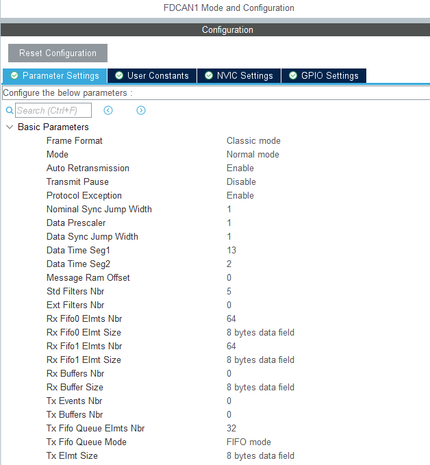
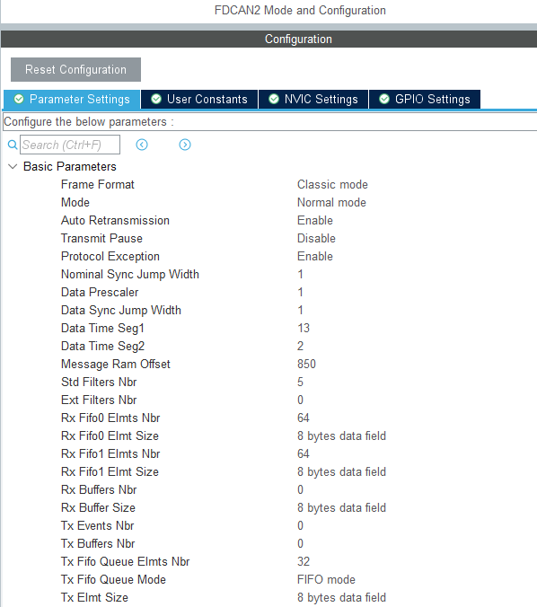
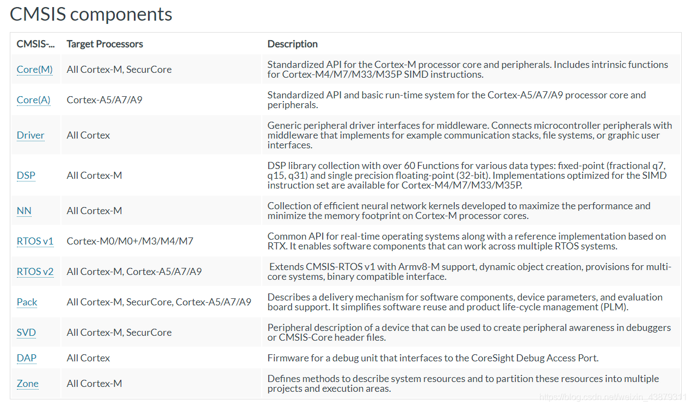

# H7VGTx_Demo

## 软件环境

 - Toolchain/IDE : Keil MDK-ARM V5 | STM32CubeMX Version 6.10.0
 - package version: STM32Cube FW_H7 V1.9.0（最新版本v1.11.1更新过usb，使用时会进硬件中断）
 - FreeRTOS version: 10.3.1
 - CMSIS-RTOS version: 1.02

## 代码风格

文件编码：UTF-8（使用UTF-8在显示中文和打印中文不会乱码）

缩进：统一使用四个空格作为一次缩进

变量和函数命名：Unix/Linux 风格

宏定义：统一全大写，用下划线分割。

头文件引用：在.h文件中只引用声明结构体、变量等必要的头文件。在.c文件中引用头文件由复杂到简单引用。

## FDcan配置

波特率为1Mbps，所以1个can1ms最多传输1000000/1000/108=9.26帧数据（DLC为8的标准帧为108bit）。如果can设备是大疆电机，收发需要2帧数据，1个can最多接4个电机不丢包。如果can设备是陀螺仪，只需要收，那么可以接收9个ID。总的来说，标准过滤器设置5个是足够的（用列表模式，10个ID）。

canRAM空间共有2560words大小，其中can1分配850words，can2分配850words，can2分配860words。1个标准帧消息占4个words，所以fifo大小直接拉到最大，接收为64，发送为32，还剩850 - 5 - 64 * 4 * 2 - 32 * 4 = 205words。剩下空间看需求分配。





can中断只开启中断0就足够。默认情况下所有can中断都会进中断0，这里有两个中断目的是为了中断分流。详细可见以下网址：https://www.armbbs.cn/forum.php?mod=viewthread&tid=119164


## 操作系统版本选择



RTOS v1使得软件能够在不同的实时操作系统下运行（屏蔽不同RTOS提供的API的差别），而RTOS v2则是拓展了RTOS v1，兼容更多的CPU架构和实时操作系统。

由上图可以看出RTOS v1兼容Cortex-M7，也就是说兼容stm32h723。我们没必要选择RTOS v2，更高的兼容性背后时更加冗余的代码，理解起来比较困难；如果选择Disable则使用RTOS厂商提供的API，CubeIDE将不会提供图形化配置服务；所以在CubeMX配置时选择RTOS v1就足够了。

## FPU单元说明


CubeMX中在FREEROTS有关于FPU的使能，经研究发现

H7是用不到ENABLE_MPU的，使能与否都没关系，它是给ARMv8M架构新版准备的，详情看以下链接：

https://www.freertos.org/2020/04/using-freertos-on-armv8-m-microcontrollers.html

在HAL库中 FPU的开启与否在system_stm32h7xx.c中的SystemInit函数，如下

```
  /* FPU settings ------------------------------------------------------------*/
  #if (__FPU_PRESENT == 1) && (__FPU_USED == 1)
    SCB->CPACR |= ((3UL << 10*2)|(3UL << 11*2));  /* set CP10 and CP11 Full Access */
  #endif
```

**对于具体的FPU功能添加如下（本工程已添加）：**

1. 由CubeMX生成的代码第一次生成勾选添加全部相关库，会在rm_main\Drivers\CMSIS中加上各种库，其中就有DSP库。(后续将各种库删除，并将选项改为只添加所需相关库来减小工程大小)

2. 移植和添加库和头文件

   将所需的文件移植到\rm_main\User\Math\DSP中，其中

   arm_cortexM7lfdp_math.lib（双精度浮点Cortex-M7小端模式）为库文件，添加进工程中。

   \Include为各头文件，添加进工程头文件路径。

   \Source为各函数具体实现，不用添加进工程，需要研究具体实现时查看即可。

3. 添加宏定义

   打开Keil工程的配置界面，切换至C/C++选项卡，添加如下宏定义：

   FPU_PRESENT ==1U,ARM_MATH_CM4,CC_ARM,__TARGET_FPU_VFP

   可以在core_cm7.h文件中看到起效，且system_stm32h7xx.c中的SystemInit函数中的宏定义也起效。

   

4. 直接在main.h中添加arm_math.h文件，为整个工程配置上DSP库

**附加说明**


此处注意是Double Precision

## DMA串口发送注意点

在进行DMA发送前，通常会在前面加`while(HAL_DMA_GetState(&hdma_usart1_tx) == HAL_DMA_STATE_BUZY);`来等待上一次发送完成。但经过测试，`HAL_DMA_GetState()`在初始化后它的状态就不会变了，使用`while((&huart1)->gState == HAL_UART_STATE_READY);`才能正常等待。

连续两次发送没有等待的结果是只有第一次发送成功，第二次发送`HAL_UART_Transmit_DMA()`会返回HAL_BUSY。
